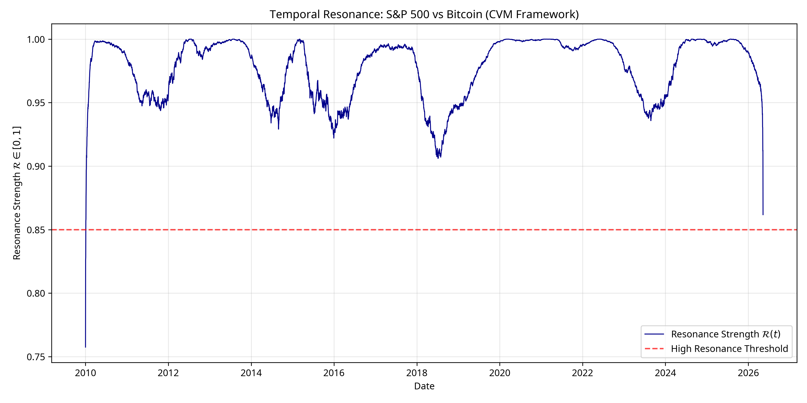

# The Bridge Maker: Quantum Finance and Semantic Value

The **Bridge Maker** ecosystem represents a paradigm shift in financial engineering, introducing the **Chronometric Valuation Model (CVM)**. Developed by **Umair Abbas** and introduced by **Cryptographic House - UA**, this framework replaces traditional linear time with a multi-harmonic temporal lattice, enabling the identification of rhythmic patterns and resonant frequencies within global markets [1].

## Chronometric Valuation Model (CVM)

The **Chronometric Valuation Model (CVM)** is a sophisticated financial framework that derives asset valuation through vectors in phase space. By utilizing multi-harmonic temporal bases—specifically 3, 6, 9, and 12-year cycles—the CVM treats value as a geometric phase-space phenomenon rather than a simple time-series variable [1] [2].

### Core Theoretical Foundations

The CVM is built upon several key pillars that distinguish it from traditional econometric models:

*   **Multi-Harmonic Temporal Lattice**: Time is modeled as a lattice $\Lambda \subset \mathbb{R}^n$, where each event is mapped to a point on an $N$-torus of harmonic phases $\mathbb{T}^N$.
*   **Chronal Anchors**: The model utilizes invariant temporal significance points, such as the 2008 Lehman collapse, to establish proper chronal coordinates $\tau_k$ [2].
*   **Temporal Resonance**: The alignment between financial instruments is quantified via a resonance metric $\mathcal{R}$, analogous to quantum fidelity between coherent states [2].

### Empirical Demonstration: S&P 500 and Bitcoin

The following visualization demonstrates the **Temporal Resonance** between the S&P 500 and Bitcoin, calculated using the CVM framework's harmonic cadences. High resonance events (where $\mathcal{R} > 0.85$) indicate periods of significant temporal alignment between these disparate asset classes.

## Ecosystem Components

The Bridge Maker project integrates multiple advanced technologies to ensure security, transparency, and cross-system compatibility.

| Component Name | Acronym | Technical Function | Core Concept | Status |
| :--- | :--- | :--- | :--- | :--- |
| **Chronometric Valuation Model** | CVM | Phase-space vector valuation via multi-harmonic temporal bases. | Time as a multi-harmonic lattice; value as temporal resonance. | Production-ready |
| **Orientation Registry Graph** | ORG | Spatiotemporal graph modeling of financial actors and capital flows. | Graph-based financial topology and phase-shift weighting. | Production-ready |
| **Quantum Block Torch** | QBT | Cryptographic substrate providing FHE, ZKPs, and lattice-based security. | Post-quantum safety and cryptographic transparency. | Production-ready |
| **Quantum-Entangled Ledger** | QEL | Non-local transaction linking via temporal Bell states. | Security through quantum coherence and relational consistency. | Research Stage |
| **Quantumind** | Quantumind | Post-quantum infrastructure and quantum engineering. | Post-quantum security and AI ethics integration. | Active Development |
| **Side-channel** | SideChannel | Adaptive architectures resistant to power and timing attacks. | Global phase coherence for hardware security. | Production-ready |
| **Stockist Post-Quantum** | Stockist PQ | Legacy system migration to chronal coordinates. | Mapping traditional timestamps to quantum-secure ontology. | Production-ready |

## Technical Implementation

The CVM ecosystem leverages a modern, high-performance technology stack:

*   **Analysis & Modeling**: Python (`numpy`, `pandas`, `scipy`, `statsmodels`, `plotly`) for phase extraction and resonance calculation.
*   **Formal Documentation**: LaTeX (`amsmath`, `quantum`, `tikz`) for mathematical proofs and architectural diagrams.
*   **Cryptographic Substrate**: TypeScript and Python for lattice-based cryptography and ZKP implementation.
*   **Hardware Layer**: Tunable artificial atoms for the Quantum-Entangled Ledger (QEL) security layer.

## Author

**Umair Abbas**
[ORCID: 0009-0008-3968-2252](https://orcid.org/0009-0008-3968-2252)

## License

This project is part of the *Chronal Ruler* thesis (2026). All rights reserved by **Cryptographic House - UA**.

## References

[1] Abbas, U. (2026). *The Chronal Ruler: A Multi-Harmonic Approach to Financial Valuation*. Cryptographic House - UA.
[2] Abbas, U. (2026). *Appendix A: Chronometric Valuation Model (CVM) Technical Specifications*. [cvm_appendix.tex](./cvm_appendix.tex).
[3] Siddiquie, U. (2026). *Orientation Registry Graph (ORG) Documentation*. [GitHub Repository](https://github.com/umairsiddiquie/org).
